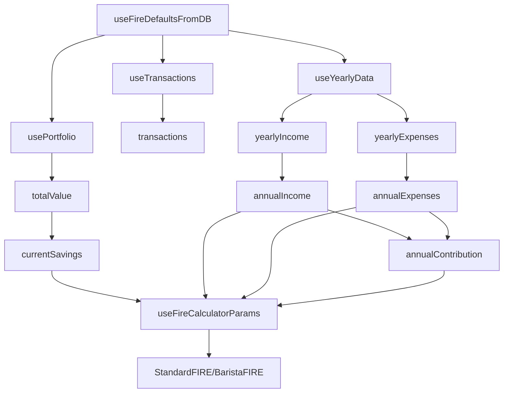
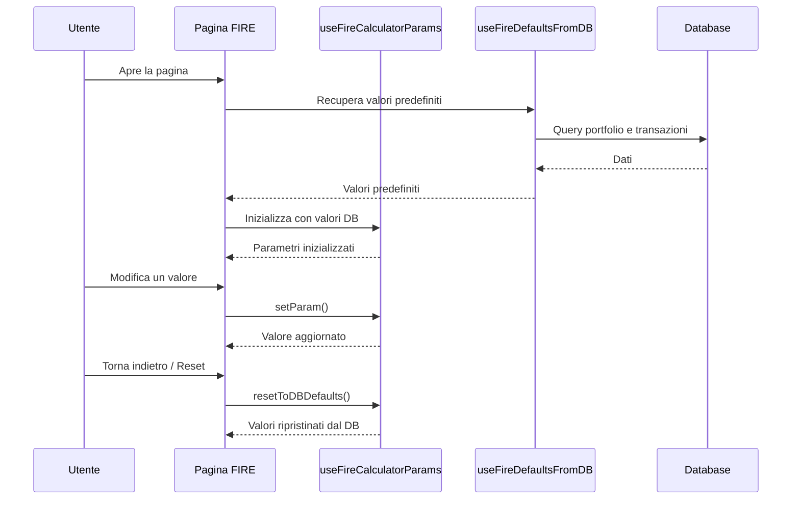

# Piano: Valori Predefiniti FIRE dal Database

## Obiettivo
Implementare valori predefiniti per i calcolatori FIRE che vengono calcolati automaticamente dai dati presenti nel database, permettendo all'utente di modificarli temporaneamente ma con la possibilità di tornare ai valori predefiniti.

## Analisi Attuale

### Sistema Esistente
- **Hook `useFireCalculatorParams`**: Gestisce i parametri del calcolatore con valori predefiniti hardcoded
- **Hook `usePortfolio`**: Fornisce il valore totale del portafoglio (`totalValue`)
- **Hook `useTransactions`**: Fornisce tutte le transazioni con tipo (income/expense)
- **Hook `useYearlyData`**: Può essere usato per raggruppare dati annuali

### Valori da Calcolare
1. **Risparmio attuale** (`currentSavings`) - dal valore totale del portafoglio
2. **Risparmi Annuali** (`annualContribution`) - calcolato come reddito annuale - spese annuali
3. **RAN** (`annualIncome`) - somma delle transazioni di tipo 'income' nell'ultimo anno
4. **Spese Annuali** (`annualExpenses`) - somma delle transazioni di tipo 'expense' nell'ultimo anno

## Architettura Proposta



## Implementazione

### 1. Nuovo Hook: `useFireDefaultsFromDB`

**File**: `src/hooks/useFireDefaultsFromDB.ts`

```typescript
import { useMemo } from 'react'
import { usePortfolio } from './usePortfolio'
import { useTransactions } from './useTransactions'
import { useYearlyData } from './useYearlyData'

interface FireDefaults {
  currentSavings: number
  annualIncome: number
  annualExpenses: number
  annualContribution: number
}

export function useFireDefaultsFromDB(): FireDefaults | null {
  const { totalValue } = usePortfolio()
  const { transactions } = useTransactions()
  
  // Calcola reddito annuale (ultimo anno completo)
  const yearlyIncome = useYearlyData({
    items: transactions.filter(t => t.type === 'income'),
    getDate: (t) => t.date,
    getValue: (t) => Number(t.amount),
  })
  
  // Calcola spese annuali (ultimo anno completo)
  const yearlyExpenses = useYearlyData({
    items: transactions.filter(t => t.type === 'expense'),
    getDate: (t) => t.date,
    getValue: (t) => Number(t.amount),
  })
  
  return useMemo(() => {
    // Se non ci sono dati sufficienti, ritorna null
    if (yearlyIncome.length === 0 && yearlyExpenses.length === 0) {
      return null
    }
    
    // Prendi l'anno più recente con dati
    const latestIncome = yearlyIncome.length > 0 ? yearlyIncome[0].total : 0
    const latestExpenses = yearlyExpenses.length > 0 ? yearlyExpenses[0].total : 0
    
    // Calcola i risparmi annuali come reddito - spese
    const annualContribution = Math.max(0, latestIncome - latestExpenses)
    
    return {
      currentSavings: totalValue,
      annualIncome: latestIncome,
      annualExpenses: latestExpenses,
      annualContribution,
    }
  }, [totalValue, yearlyIncome, yearlyExpenses])
}
```

### 2. Modifica Hook: `useFireCalculatorParams`

**File**: `src/hooks/useFireCalculatorParams.ts`

#### Modifiche richieste:

1. **Aggiungere un nuovo parametro per i valori predefiniti dal database**
2. **Modificare la funzione `getParam` per usare i valori dal database come fallback**
3. **Aggiungere un metodo `resetToDBDefaults` per resettare ai valori del database**

#### Nuova logica di priorità:

```
URL params > localStorage > DB defaults > hardcoded defaults
```

### 3. Aggiungere Reset ai Valori del Database

Aggiungere un nuovo metodo `resetToDBDefaults` che:
1. Pulisce i parametri URL
2. Pulisce localStorage
3. Imposta i valori predefiniti dal database

## Flusso di Utilizzo



## Dettagli di Implementazione

### Calcolo dei Valori Annuali

Per calcolare correttamente i valori annuali:

1. **RAN (Reddito Annuale Netto)**:
   - Filtra le transazioni con `type === 'income'`
   - Raggruppa per anno usando `useYearlyData`
   - Prendi il totale dell'anno più recente

2. **Spese Annuali**:
   - Filtra le transazioni con `type === 'expense'`
   - Raggruppa per anno usando `useYearlyData`
   - Prendi il totale dell'anno più recente

3. **Risparmi Annuali**:
   - Calcolato come: `RAN - Spese Annuali`
   - Assicurarsi che non sia negativo (minimo 0)

4. **Risparmio Attuale**:
   - Usa direttamente `totalValue` da `usePortfolio`

### Gestione dello Stato

Il sistema deve gestire tre stati:

1. **Valori predefiniti dal database**: Calcolati dinamicamente
2. **Valori modificati dall'utente**: Salvati in localStorage e URL params
3. **Valori hardcoded**: Fallback quando non ci sono dati nel database

### Comportamento di Reset

Quando l'utente vuole tornare ai valori predefiniti:

1. Il metodo `resetToDBDefaults()` viene chiamato
2. I parametri URL vengono rimossi
3. localStorage viene pulito
4. I valori vengono ricalcolati dal database

## Vantaggi

1. **Valori sempre aggiornati**: I valori predefiniti riflettono sempre i dati più recenti
2. **Flessibilità**: L'utente può comunque modificare i valori per fare simulazioni
3. **Semplicità**: Un solo click per tornare ai valori reali
4. **Persistenza**: Le modifiche temporanee vengono salvate per la sessione corrente

## Considerazioni Edge Cases

1. **Nessun dato nel database**: Usare i valori hardcoded esistenti
2. **Dati parziali**: Usare i dati disponibili e calcolare il resto
3. **Anno corrente incompleto**: Considerare l'anno più recente con dati completi
4. **Valori negativi**: Assicurarsi che i risparmi annuali non siano negativi

## Prossimi Passi

1. Implementare l'hook `useFireDefaultsFromDB`
2. Modificare `useFireCalculatorParams` per integrare i valori dal database
3. Aggiungere il metodo `resetToDBDefaults`
4. Aggiornare i componenti UI per mostrare un pulsante "Reset ai valori dal database"
5. Testare con dati reali e edge cases
